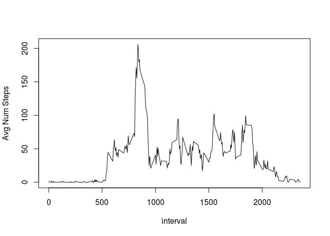

# Reproducible Research: Peer Assessment 1

### First, cleaning up the environment:

```r
rm(list=ls(all=TRUE)) 
```


## Loading and preprocessing the data

* Load the data

```r
activity <- read.csv(unz("activity.zip","activity.csv"))
```

* Process/transform the data (if necessary) into a format suitable for your analysis

```r
activity$date <- as.Date(as.character(activity$date), format = "%Y-%m-%d")
```


## What is mean total number of steps taken per day?

* Make a histogram of the total number of steps taken each day

```r
totalSteps <- aggregate(steps~date,data=activity,sum,na.rm=TRUE)
hist(totalSteps$steps, xlab = "Total steps/day", ylab = "Frequency", breaks = 20, col = "green3", main = "Histogram of the total number os steps taken per day")
```

<!-- -->

* Calculate and report the mean and median total number of steps taken per day

```r
mean(totalSteps$steps)
```

```
## [1] 10766.19
```


```r
median(totalSteps$steps)
```

```
## [1] 10765
```


## What is the average daily activity pattern?

* Make a time series plot of the 5-minute interval (x-axis) and the average number of steps taken, averaged across all days (y-axis).

```r
stepsInterval<-aggregate(steps~interval,data=activity,mean,na.rm=TRUE)
plot(steps~interval,data=stepsInterval,type="l", ylab = "Avg Num Steps")
```

<!-- -->

* Which 5-minute interval, on average across all the days in the dataset, contains the maximum number of steps?

```r
fiveMinMaxNumSteps <- stepsInterval[which.max(stepsInterval$steps),]$interval
```
It is the **835th** interval.


## Imputing missing values

* Calculate and report the total number of missing values in the dataset (i.e. the total number of rows with NAs)

```r
totalMissValues <- sum(is.na(activity$steps))
```
Total missing values: 2304.

* Devise a strategy for filling in all of the missing values in the dataset. The strategy does not need to be sophisticated. For example, you could use the mean/median for that day, or the mean for that 5-minute interval, etc.
* Create a new dataset that is equal to the original dataset but with the missing data filled in.

```r
cleanData <- activity
cleanData$steps[is.na(cleanData$steps)] <- tapply(cleanData$steps, cleanData$interval, mean, na.rm = TRUE)
```


* Make a histogram of the total number of steps taken each day and Calculate and report the mean and median total number of steps taken per day. Do these values differ from the estimates from the first part of the assignment? What is the impact of imputing missing data on the estimates of the total daily number of steps?

```r
totalStepsCleanData<-aggregate(steps~date,data=cleanData,sum)
hist(totalStepsCleanData$steps, xlab = "Total steps/day", ylab = "Frequency", breaks = 20, col = "green3", main = "Total number os steps taken per day (without missing values)")
```

<!-- -->

```r
meanStepsCleanData <- mean(totalStepsCleanData$steps)
medianStepsCleanData <- median(totalStepsCleanData$steps)
```
* The **mean** total number of steps taken per day: 1.0766189\times 10^{4} steps.
* The **median** total number of steps taken per day: 1.0766189\times 10^{4} steps.

* Do these values differ from the estimates from the first part of the assignment? What is the impact of imputing missing data on the estimates of the total daily number of steps?

: The **mean** value is the **same** as the value before imputing missing data because we put the mean value for that particular 5-min interval. The median value shows **a little** difference : but it depends on **where the missing values are**.


## Are there differences in activity patterns between weekdays and weekends?

* Create a new factor variable in the dataset with two levels – “weekday” and “weekend” indicating whether a given date is a weekday or weekend day.

```r
cleanData$day=ifelse(as.POSIXlt(as.Date(cleanData$date))$wday%%6==0,
                          "weekend","weekday")
cleanData$day=factor(cleanData$day,levels=c("weekday","weekend"))
```


* Make a panel plot containing a time series plot (i.e. type = "l") of the 5-minute interval (x-axis) and the average number of steps taken, averaged across all weekday days or weekend days (y-axis). See the README file in the GitHub repository to see an example of what this plot should look like using simulated data.

```r
stepsInterval2=aggregate(steps~interval+day,cleanData,mean)
library(lattice)
xyplot(steps~interval|factor(day),data=stepsInterval2,aspect=1/3,type="l")
```

<!-- -->
